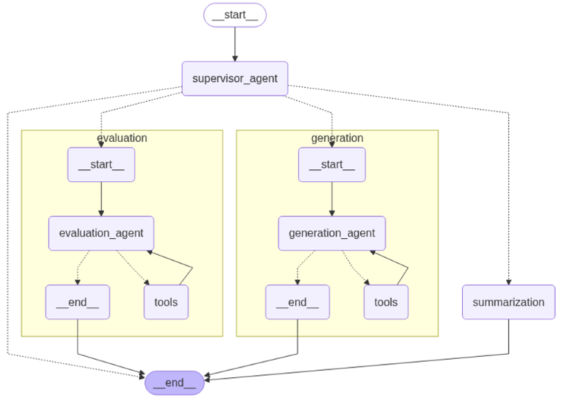
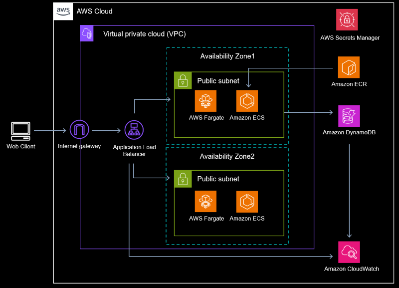
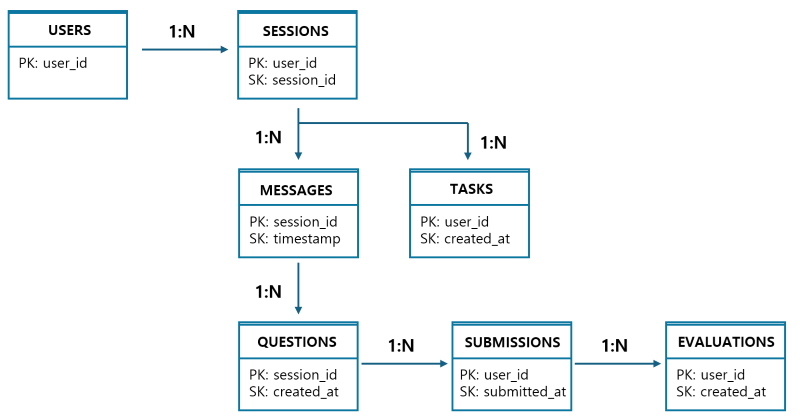

# Korean Writing Assessment Chatbot
>AI-powered Korean writing tutor with GPT-4o and LangGraph multi-agent system

## Overview

#### **Problem Statement**  
International students learning Korean face:
- Limited access to qualified instructors (avg. wait time: 3 days)
- Inconsistent feedback quality across different tutors
- High cost ($50-100 per session)
  
#### **Solution**  
AI-powered writing tutor providing:  
- Instant feedback (5.2s avg response time)
- Consistent evaluation (0.7 QWK vs human raters)
- 95% cost reduction vs. human tutors

#### **Business Impact**
- Reduced assessment time by 85% (30min → 4.5min per student)
- Enabled 24/7 feedback availability with 0.7 QWK accuracy (human-level)
- Scalable to 100+ concurrent users with <$50/month operational cost

#### **Key Features**:
- Automated essay evaluation (0.7 QWK accuracy)  
    → *Matches human expert consistency, available 24/7*
- Automatic Korean writing question generation tailored to user request  
    → *Personalized learning paths based on proficiency*
- Real-time personalized feedback  
    → *Students get explanations, not just scores*
- Multi-agent architecture (Supervisor/Generation/Evaluation/QA)
- Production AWS deployment (ECS Fargate + DynamoDB)

---

## Solution Architecture

**AI Workflow**:
- Supervisor agent routes user intent to specialized sub-agents
- Parallel execution: Task generation / Evaluation / Feedback Summarization / Q&A
- State management preserves conversation context (up to 50 turns)




**Infrastructure Highlights**:
- Multi-AZ deployment with Application Load Balancer
- ECS Fargate for serverless container orchestration
- DynamoDB 7-table design for flexible schema
- CloudWatch for logging, metrics, and cost tracking




---

## Technical Decisions

### Why LangGraph?
- Explicit state management with Python TypedDict
- Cyclic workflow
- Autonomous Tool Calling
- Modular Subgraphs

### Why ECS Fargate over Lambda?
- Average response time: ~5 seconds (Lambda cold start unsuitable)
- Stateful conversation management needs persistent connections
- Auto-scaling based on CPU/memory

### Why DynamoDB?
- Schema flexibility for evolving evaluation criteria
- On-demand capacity for variable traffic patterns
- 7-table design:
  - `Users`: User profiles
  - `Messages`: Chat history
  - `Sessions`: Conversation groups
  - `Tasks`: Agent task tracking
  - `Questions`: Generated questions
  - `Submissions`: User submissions
  - `Evaluations`: Assessment results



---

## Implementation Highlights
**Rubric Redesign(Evaluation):**
- Analyzed 1,000 sampled essays to identify score-band-specific writing features
- Redesigned LLM evaluation rubrics achieving QWK 0.7

**Prompt-Based Scoring Control:**
- Built rubric-driven evaluation prompt with structured scoring steps
- Implemented penalty-based rules to mitigate LLM over-scoring tendencies

**Exam-Style Task Generation:**
- Decomposed exam-style questions into explicit generation stages
- Leveraged Few-shot CoT and CO-STAR prompting techniques
- Validated by domain experts confirming high similarity to real exam items

**Container Optimization:**
- Containerized FastAPI inference service using Docker
- Reduced image size from 1.2GB to 870MB via multi-stage builds

**Cost-Aware AWS Architecture:**
- Replaced NAT Gateway + private subnet architecture with public subnet setup
- Reduced estimated monthly costs by ~$35 while maintaining security controls

**Production Monitoring & Stability:**
- Implemented CloudWatch dashboards for real-time monitoring
- Resolved ECS–ALB health check failures with dedicated low-latency `/health` endpoint

---

## Challenges & Solutions

### 502 Bad Gateway Errors
**Problem**: ECS tasks failing health checks intermittently  
**Root Cause**: Health check timeout (5s) < API response time  
**Solution**: 
- Implemented `/health` endpoint returning immediate 200 OK
- Increased deregistration delay to 30s for graceful shutdown

### Production Bot Traffic Management
**Problem:**
- 44% 4xx error rate detected in CloudWatch metrics
- Attack vectors: `.env` exposure attempts, Spring Boot actuator scans, PHP vulnerability probes
-  Public API exposed to internet-wide automated scanners
**Solution Implemented:** Filtered bot traffic from CloudWatch metrics to track actual user errors

### Cost Management (In Progress)
**Current Status**: Measuring per-session token usage via CloudWatch  
**Goal**: Maintain cost under $0.03 per session  
**Approach**: Reducing token consumption by optimizing prompt length (Q&A, summarization)

### Question Diversity Improvement (In Progress)
**Challenge**: Fill-in-blank questions show 80% vocabulary pattern similarity  
**Approach**:
- Specifying and diversifying target vocabulary/grammar items when generating complete sentences
- Testing temperature parameter adjustment for increased variability

---

## Performance Metrics

| Metric                        | Value | Note                          |
| ----------------------------- | ----- | ----------------------------- |
| Average Response Time         | 5.2s  | p50 latency (from CloudWatch) |
| p99 Latency                   | 12.3s | Includes LLM inference time   |
| Evaluation Consistency (QWK)  | 0.70  | vs. human annotators          |
| Agent Classification Accuracy | 100%  | 50 test cases                 |
| Output Format Compliance      | 93%   | Average across all agents     |
| Active Test Users             | 8     | As of 2025-01-14              |

---
## Project Structure
```
├── app/                    # FastAPI application
│   ├── routers/            # API endpoints (auth, health)
│   └── static/             # Frontend assets
├── node/                   # LangGraph agent nodes
│   ├── supervisor.py       # Task routing agent
│   ├── generation.py       # Question generation agent
│   ├── evaluation.py       # Essay scoring agent
│   ├── summarization.py    # Feedback generation agent
│   └── qa.py               # Q&A agent
├── workflow/               # LangGraph workflow orchestration
├── repository/             # DynamoDB data access layer
├── services/               # Business logic services
├── model/                  # Pydantic data models
├── core/                   # Configuration and settings
├── clients/                # External API clients (OpenAI, AWS)
├── tests/                  # Test suite (42 pytest cases)
├── scripts/                # Utility scripts
├── docs/                   # Architecture diagrams
├── Dockerfile              # Container configuration
├── docker-compose.yaml     # Local development setup
├── task-def.json           # ECS task definition
└── requirements.txt        # Python dependencies
```

---
## Contact
sseunjiss@gmail.com
